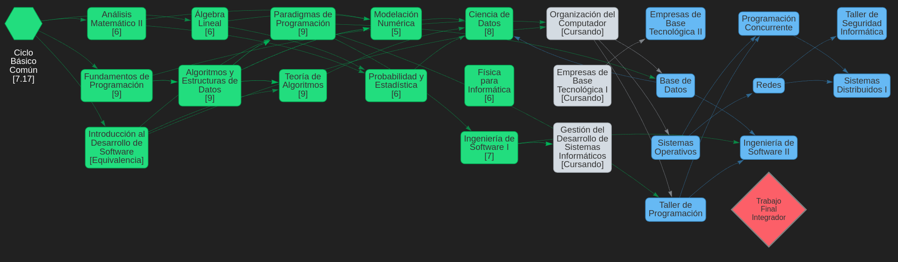

Hi there! :wave:

I'm Taiel, and I'm currently studying Software Engineering at FIUBA. I have approved 13/24 of mandatory subjects.

I'm looking forward to collaborating on open source projects, and have my first experiences working freelance.

Also im studying on my own:

- English.
- FullStack development (React and a bit of languages for backend).
- Machine Learning.

